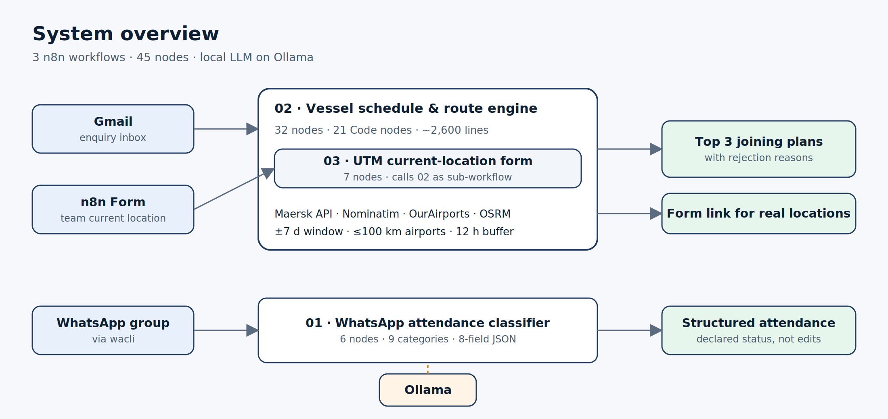
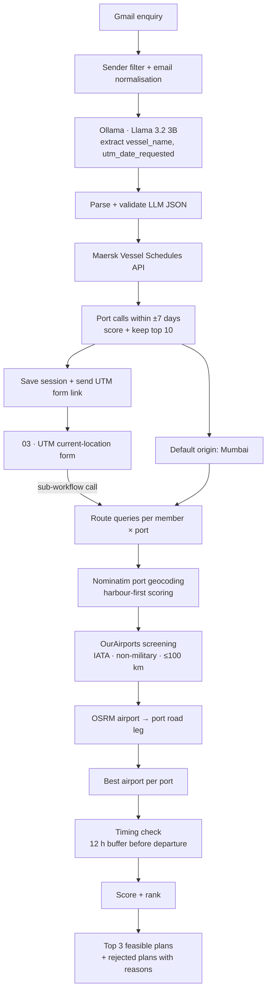
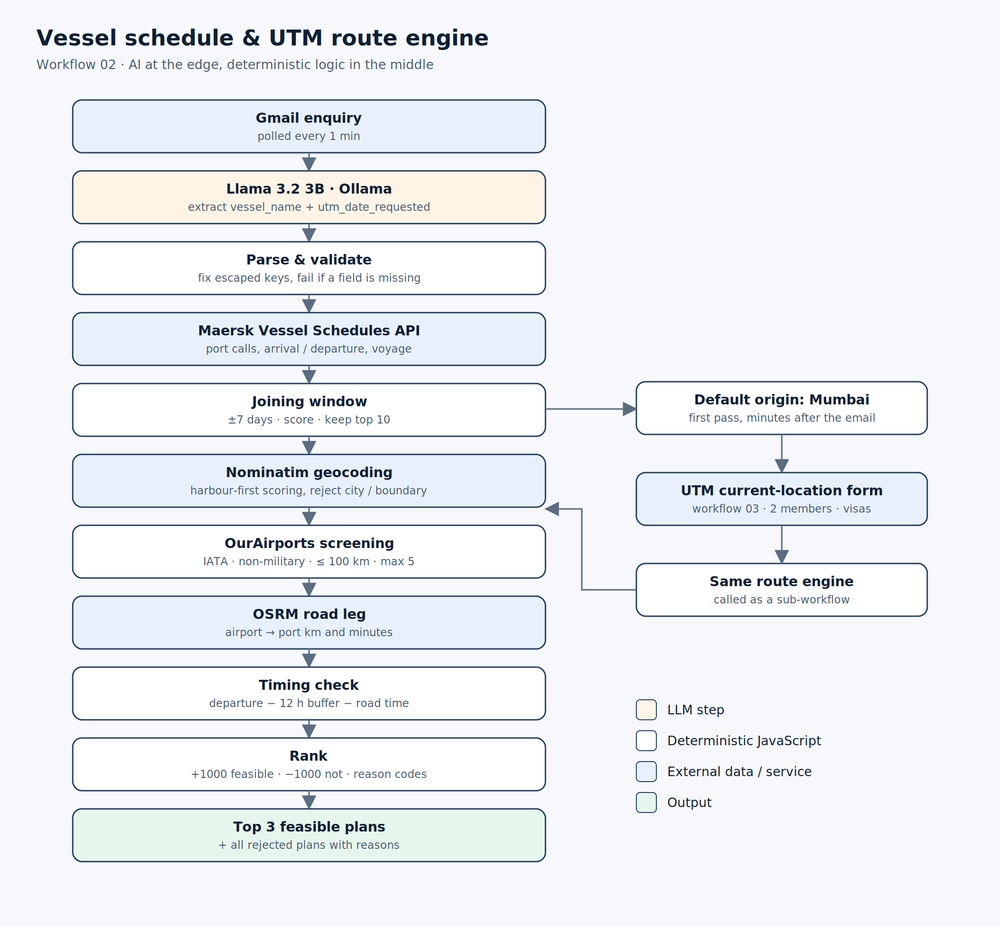
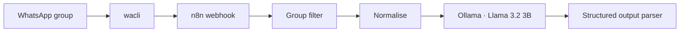

# Intelligent Operations Automation

n8n workflows I built at VSL Marine Technology to take the manual work out of two recurring jobs:

1. **Planning how a UTM (ultrasonic thickness measurement) team joins a vessel** – reading the enquiry, checking the vessel's schedule, and working out which port, airport and timing actually make sense.
2. **Reading attendance messages in the office WhatsApp group** – "reaching by 11", "WFH today", "leaving early" – and turning them into structured records.

Local LLMs (Ollama) are used only where the input is unstructured text. Everything that decides whether a plan is feasible – port selection, airport screening, road routing, timing – is plain, testable JavaScript.

   

> This is a sanitised portfolio copy. API keys, credentials, internal IDs, email addresses, group IDs and business data have been removed. See [docs/security.md](docs/security.md).



---

## At a glance

| | |
|---|---:|
| n8n workflows | **3** |
| Functional nodes | **45** |
| Custom JavaScript Code nodes | **24** (~2,770 lines) |
| External data sources | **4** – Maersk Schedules API, OpenStreetMap Nominatim, OSRM, OurAirports |
| LLM | Llama 3.2 **3B**, running locally on Ollama (no data leaves the machine) |
| Enquiry polling interval | **1 min** |
| Joining window evaluated | **±7 days** around the requested UTM date |
| Candidate port calls kept | up to **10** |
| Airport screening radius | **100 km** straight-line, IATA-coded, non-military |
| Airports routed per port | up to **5** (OSRM road distance + time) |
| Safety buffer before vessel departure | **12 h** |
| Plans returned | **Top 3** feasible, plus every rejected plan with its reason |
| UTM form | **13** fields, **2** members, **4** joining preferences |
| WhatsApp categories | **9**, returned as an **8-field** JSON object |
| Hard-coded secrets in this repo | **0** (checked in CI) |

**Test run (Beirut call):** vessel alongside for **40 h** (13 Oct 21:00 → 15 Oct 13:00, UTC+3). Selected airport **BEY**, **7.84 km** straight-line, **9.13 km / ~7.7 min** by road. Plan marked feasible with the 12 h buffer applied.

---

## Workflows

| # | File | Trigger | What it does |
|---|---|---|---|
| 01 | [`01-whatsapp-attendance-classifier.json`](workflows/01-whatsapp-attendance-classifier.json) | Webhook (from wacli) | Filters one group, normalises the payload, classifies the message with Llama 3.2 3B |
| 02 | [`02-vessel-schedule-route-intelligence.json`](workflows/02-vessel-schedule-route-intelligence.json) | Gmail poll / sub-workflow call | Enquiry → schedule → joining ports → airports → road leg → timing → Top 3 plans |
| 03 | [`03-utm-current-location-form.json`](workflows/03-utm-current-location-form.json) | n8n Form | Collects real member locations and re-runs the route engine in 02 |

---

## How the vessel planning works



### Why the LLM does so little

The model only reads the email and returns two fields. A 3B model is good enough for that and runs on an office machine. I did not want it choosing ports or deciding if a joining is possible, because those answers need to be explainable to an operations manager. Every plan in the output carries the numbers that produced it: port stay hours, airport distance, road minutes, latest safe arrival, score and status.

The model output is also not trusted as-is. It sometimes returns escaped keys (`vessel\_name`) or wraps JSON in text, so a parser node cleans it and fails loudly if either field is missing.

### Scoring, briefly

**Port calls** (preliminary): +100 if the vessel is in port on the requested date, −10 per day away from it, +8 / +15 / +20 for stays of 12 / 24 / 48 h, +10 scheduled or +5 estimated.

**Airports:** +30 IATA, +10 aerodrome, −100 military, +10 to +40 by distance band. After OSRM: +10 to +30 for road time under 120 / 60 / 30 min, +5 to +15 for road distance.

**Final plan:** +1000 if timing is feasible, −1000 if not, +200 each for in-port / within-stay on the requested date, plus airport score, road-time and schedule-confidence adjustments, −10 if visa is still unconfirmed. Only feasible plans can make the Top 3.

Plans where the vessel has already sailed are **rejected with a reason code** (`VESSEL_DEPARTS_BEFORE_UTM_REQUESTED_DATE`) instead of being quietly ranked lower. Full detail in [docs/route-engine.md](docs/route-engine.md).



### Mumbai first, real locations second

The first pass assumes the team travels from Mumbai, so ops gets an answer within minutes of the email arriving. The output includes a **"Find best routes from current location"** link to workflow 03. If people are elsewhere, they fill the form and the **same** route engine runs again with their actual city, availability and visa permissions. There is no second copy of the routing logic.

---

## WhatsApp attendance classifier



Categories: `leave`, `half_day`, `work_from_home`, `late_arrival`, `early_leaving`, `birthday`, `celebration`, `general`, `unclear`

Example output:

```json
{
  "category": "late_arrival",
  "confidence": 0.93,
  "reason": "Sender says they will reach office by 11.",
  "employee": "Demo User",
  "date": "2026-09-14",
  "mentioned_time": "11:00",
  "leave_requested": false,
  "leave_duration": null
}
```

The classifier records what people *said*. It does not change attendance. The biometric system (TeamOffice) remains the source of truth, and the plan is to reconcile the two rather than let a model edit records. The prompt says this explicitly: no salary maths, no assuming leave is approved. See [docs/whatsapp-attendance.md](docs/whatsapp-attendance.md).

---

## Tech stack

**Orchestration:** n8n (Gmail trigger, Webhook, Form trigger, Code, HTTP Request, Data Tables, Execute Workflow)
**AI:** Ollama, Llama 3.2 3B, LangChain LLM chain with structured output parser
**Data / APIs:** Maersk Commercial Schedules API, OpenStreetMap Nominatim, OSRM, OurAirports CSV
**Messaging:** Gmail (OAuth2), wacli (WhatsApp bridge)
**Language:** JavaScript (Haversine distance, scoring, date/time windows, de-duplication, Arabic/English port-name matching)
**Tooling:** Git, GitHub Actions (JSON validation + secret scan)

---

## Repository layout

```
.
├── workflows/          sanitised n8n exports (import these)
├── docs/               architecture, route engine, WhatsApp, form, setup, security
├── architecture/       diagrams (SVG + PNG)
├── data/demo/          synthetic inputs and outputs – no real data
├── database/           Data Table schema (SQL equivalent)
├── scripts/            secret scan + workflow validator (Node, no dependencies)
├── screenshots/        n8n canvas and result screenshots
└── .github/workflows/  CI checks
```

## Running it locally

Short version (full steps in [docs/setup.md](docs/setup.md)):

```bash
cp .env.example .env         # fill in your own values
ollama pull llama3.2:3b
npx n8n                      # http://localhost:5678
```

Import the three files from `workflows/`, reconnect Gmail and Ollama credentials, create the ` UTM Form Sessions` Data Table, and download `airports.csv` from [OurAirports](https://ourairports.com/data/).

## Known limitations

I'd rather list these than have someone find them:

- The Maersk request uses a configured vessel code and a fixed date range. Mapping the extracted vessel name to a Maersk code and deriving the range from the requested date is next.
- The origin-side flight leg is not searched yet. Feasibility currently covers the vessel's port stay, the airport-to-port road leg and the 12 h buffer. Origin airport mapping is only filled for Mumbai and Beirut.
- The form picks the most recent Data Table session, so it assumes one active enquiry at a time. A project ID in the form URL would fix that.
- Saving the session row from workflow 02 to the Data Table is still being wired in.
- Public Nominatim and OSRM servers are rate-limited. Fine for development, not for volume.

See [docs/roadmap.md](docs/roadmap.md).

## About

Built by **Vishakha** – frontend, product and automation work .

© 2026 Vishakha. All rights reserved. Shared as a portfolio and documentation repository; see [LICENSE](LICENSE). Business logic and operational context belong to VSL Marine Technology.
